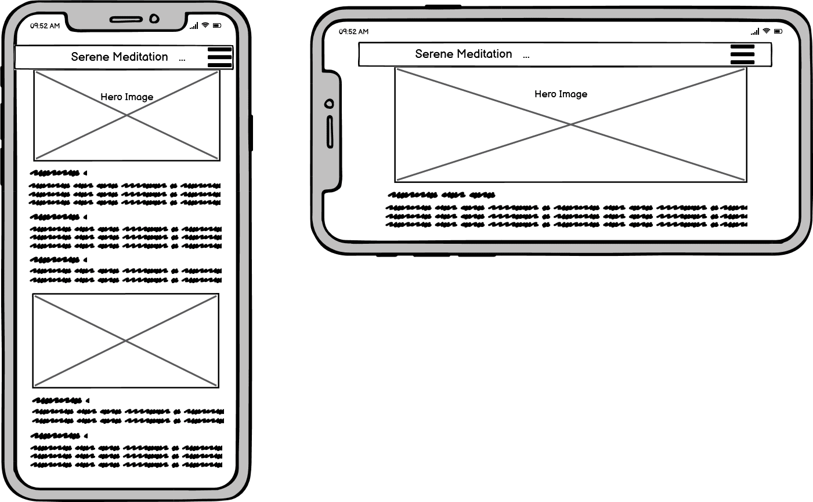
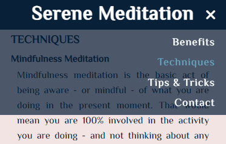

# Serene Meditation

Welcome to Serene meditation. This is a website that introduces meditation to those who are new to meditation and aims to help them get started with their meditation practice.

The users of this website will become familiar with what meditation is, the benefits of meditation, meditation techniques and tips and tricks to start their meditation journey.

## Live Website
[Serene Meditation](https://shizukadonaghue.github.io/serene-meditation/)

## Repository
https://github.com/ShizukaDonaghue/serene-meditation

## Table of Contents

## UX: User Experience
### User Stories
As a user, 
* I would like the website to be visually appealing and gives me a sense of peace and calm.
* I would like to understand what meditation is and its benefits.
* I would like to be able to learn meditation techniques and how to get started.
* I would like to be inspired to start meditation.
* I would like to be able to ask questions or provide feedback.

### Initial Concept
The initial concept was to create a website that would inspire users to start their meditation practice and help them get started. Therefore, the website would explain what benefits they could expect and what types of techniques were available, so that users could try different techniques to start their journey. 

### Wireframes
Wireframes were generated using [Balsamiq](https://balsamiq.com/) to visualise the structure of the website. The structure of the finished website slightly varies from the wireframes due to development that occurred during the building process, however, the main structure remained the same.

Wireframes for mobiles: 

Wireframes for tablets: 

Wireframes for desktop: 

### Website Structure
Serene Meditation consists of two HTML pages. The layout of the website is simple and consistent full page scroll with a fixed navigation bar at the top. The intention for this simple design is to have a clean and uncluttered website in which the user can feel calm and relaxed. 

The main page is the default landing page and the second page is accessible when the user submits a message from the main page to thank them for their message. There are five sections within the main page and they are also accessible from the navigation bar to bring the user to a specific section of the page. 

In addition to the navigation bar, the second page includes a "Home" button, so that the user can easily navigate back to the main page after submitting a message. The logo is linked to the top of the main page to deliver the same effect and the user can also choose to navigate to a specific section of the main page from the navigation bar on the second page. 

The website is fully responsive to different screen sizes and the layout is the same in all sizes with images spanning across the full width of the page. All images are adjusted to the full width of the screen, and they are displayed in the same size throughout the main page for consistency. 

Each of these images includes an inspirational quote to suit the content of the section that they are in. These images and quotes are designed to generate a positive emotional response in the user and aim to inspire them to start their meditation journey, and therefore, the images are an integral part of the website.

### Imagery
The images are carefully chosen to set the calm and peaceful tone for the website. They are beautiful images of sunrise to signify the start of a meditation journey. 

Detailed alt attribute is included for each image to describe the scenery. The intention for this is to improve accessibility so that the images will deliver the same effect for all users.

### Colour Scheme
The colour scheme for the website has taken inspiration from the hero image of Mt. Fuji at sunrise in which the morning sun is turning the top of the mountain and the surrounding sky pink. The colours chosen are calming and relaxing to enhance the user experience. 

The background colour for the website is pale pink F3E4E4 and the font for the main contents is dark grey 01212F to ensure sufficient contrast for accessibility. The navigation bar is in dark blue 092039 with contrasting font in white FFFFFF. Dark pink C98282 is used for the social media icons in the footer, and light blue 68A5BF is used for hover effects within the website.

Colour palette generated using [Coolors.co](https://coolors.co/):

### Typography
There are two fonts used in the website and they are imported from [Google Fonts](https://fonts.google.com/). For the main body of the text, EI Messiri was chosen as it has a calming flow which suits the image of the website. For the inspirational quotes, Alex Brush was chosen, which is a beautiful handwriting style to suit the images.

## Features
### Existing Features
#### Navigation Bar
Featured on both HTML pages, the fully responsive navigation bar includes the logo which links to the top of the main page, rather than reloading the page for a better user experience, and a link to each section within the main page. This will allow the user to easily navigate to their desired section without having to use the "back" button each time.

Navigation bar for screen sizes <905px:

When the hamburger menu is clicked or tapped, the drop-down menu opens, so that the user can select the section that they would like to navigate to. When hovered over, the colour of the section name changes from white to light blue, which enables the user to see which link they are selecting. The drop-down menu is semi-transparent, so the user can see the screen behind the menu, and once the selection is made, they are able to see that the desired section is now at the top of the screen. Furthermore, when the drop-down menu is open, the hamburger icon changes to "X" so that it is more intuitive for the user to know that is how the drop-down menu is closed.

    
Navigation bar for screen sizes >=905px:  

When hovered over, the colour of the section name changes from white to light blue, which enables the user to see which link they are selecting.

#### The Landing Page Image   
The landing page includes a photograph of Mt. Fuji at sunrise with an inspirational quote, aiming to inspire the user to start their meditation practice. The image includes detailed alt attribute to describe the scenery, which aims to deliver the same effect to all users.

 

#### What is Meditation?  
This section provides an overview of meditation, explaining what meditation is.

#### Benefits of Meditation  
This section summarises the main benefits the user could expect from meditation practice.

#### Techniques  
This section contains the details of five techniques available, including how to practise them. In addition, there are three images of sunrise and inspirational quotes to inspire the user, which aims to generate a positive emotional response and get started. These images also include detailed alt attribute to describe the scenery and intend to deliver the same effect for all users.

#### Tips & Tricks  
This section contains helpful tips and tricks to help the user start their meditation journey.

#### Contact Us  
This section contains a form that allows the user to send a message to ask questions or provide feedback. When hovered over, the text input area displays the border in dark pink, which enables the user to see which field they are selecting. 

When hovering over the "Submit" button with the cursor, the cursor changes to the hand pointer and the colour of "Submit" also changes from white to light blue, so that is more intuitive for the user to know that is a button. 

#### Footer  
The footer section includes links to the social media sites as well as my own GitHub and Linkedin accounts. The links open in a new tab to allow easy navigation for the user. The footer is available on both HTML pages.

#### Thank You Page  
When the user sends a message from the main page, the second HTML page opens to thank them for their message. The navigation bar is consistent with the main page and this includes a "Home" button so that the user can easily navigate back to the main page.

When hovering over the "Home" button with the cursor, the cursor changes to the hand pointer and the colour of "Home" changes from white to light blue, so that is more intuitive for the user to know that is a button, and also to be consistent with the "Submit" button.

### Future Left to Implement
* The drop-down menu from the navigation bar for smaller screen sizes currently stays open after the user selects one of the sections and navigates to the desired section. The drop-down menu is only closed by clicking or tapping on the "X" in the navigation bar. If the drop-down menu disappears once the user selects one of the sections or taps outside of the drop-down menu, it would help to improve the user experience. This is something that can be implemented once I learn JavaScript.   

* The navigation bar currently does not have a drop-down menu for the "Techniques" section, which will enable the user to navigate to a specific technique from the "Techniques" section of the navigation bar. This would be a nice addition to the website that can be implemented once I gain more experience in coding to do so.

## Technologies Used
* The website was created with [HTML](https://html.spec.whatwg.org/).
* [CSS](https://www.w3.org/Style/CSS/Overview.en.html) was used to add styling to the website.
* [Gitpod](https://www.gitpod.io/) was used to create, edit and preview the codes.
* [GitHub](https://github.com/) was used to store the codes and deploy the website.
* [Chrome Dev Tools](https://developer.chrome.com/docs/devtools/) were used extensively while adjusting the objects in the website for different screen sizes. 
* The website was validated using [W3C HTML Validation Service](https://validator.w3.org/) and [W3C CSS Validation Service](https://jigsaw.w3.org/css-validator/).
* [Balsamiq](https://balsamiq.com/) was used to generate wireframes.
* [Am I responsive?](https://ui.dev/amiresponsive) was used to generate the mockup image showing the website on various screen sizes.
* The fonts used in the website are imported from [Google Fonts](https://fonts.google.com/). 
* The website uses icons from [Font Awesome](https://fontawesome.com/).
* The website uses [cdnjs.com](https://cdnjs.com/) for Font Awesome icons so that the website loads quickly.
* The colour scheme ideas and actual colour palette were generated with [Coolors.co](https://coolors.co/).
* Images within the website were compressed with [Compressor.io](https://compressor.io/) so that the website loads quickly.

## Testing

### Bugs 
#### Resolved
Scroll-padding-top property is applied to the website so that when the link to each section is selected from the navigation bar, the desired section moves to the top of the screen below the fixed navigation bar (not hidden under the navigation bar), however, in Safari for Apple Devices, the padding was applied larger than the rem unit set and the section above was visible. The issue was not seen in the developer tools during the design phase. 

The issue was resolved by changing the scroll-padding-top property from rem to px.

Image showing scroll-padding not applied correctly before the issue was resolved:

Image showing scroll-padding applied correctly after the fix:

#### Unresolved

## Deployment
The website has been deployed to GitHub.

### Deploy to GitHub Pages
1. Navigate to the "Setting" tab in the GitHub repository.
2. Select "Pages" from the menu on the left.
3. Under "Sources," select "Deploy from a branch" and "Branch: main." Click on "Save." 
4. GitHub takes a short while to publish the website. Refresh the page and once the website is deployed, the URL will be displayed. The website is now live and operational.

    

### Fork the Repository
To make a copy of "fork" the repository,
1. Log into GitHub and locate the repository.
2. Select the "Fork" option at the top of the screen to create a copy of the repository.

    

### Create a Local Clone
1. In the GitHub repository, select "Code" button.
2. In the "Clone" box, under "HTTPS" tab, click on the clipboard icon to copy the URL.
3. In your IDE, open GitBash.
4. Change the current working directory to the location you would like the cloned directory to be made.
5. Type "git clone" and then paste the URL copied from GitHub.
6. Press enter and the local clone will be created.

    

## Credits
### Contents
* Contents for the "What is Meditation?" section were sourced from [verywellmind](https://www.verywellmind.com/what-is-meditation-2795927)
* Contents for the "Benefits of Meditation" section were sourced from [WebMD](https://www.webmd.com/balance/video/daily-meditation-benefits)
* Contents for the "Meditation Techniques" section were sourced from [INSIDER](https://www.insider.com/guides/health/mental-health/types-of-meditation)
* Contents for the "Tips & Tricks" section were sourced from [verywellmind](https://www.verywellmind.com/what-is-meditation-2795927)
* Inspirational quotes were sourced from [PositivePsychology](https://positivepsychology.com/mindfulness-quotes/), [Parade](https://parade.com/1066461/nicolepajer/meditation-quotes/), and [Keepinspiring.me](https://www.keepinspiring.me/25-meditation-quotes/)
* README.md was inspired by [TashaTJ's repository](https://github.com/TashaTJ/pawsome-portraits-v4)

### Media
* Images used were sourced from [pxhere.com](https://pxhere.com/) and [pixabay.com](https://pixabay.com/)
### Codes
* The responsive navigation bar was inspired by YouTube tutorial by [Kevin Powell](https://www.youtube.com/watch?v=8QKOaTYvYUA)

## Acknowledgements
This website was created as a portfolio 1 project for the Full Stack Software Development course at [UCD Professional Academy](https://codeinstitute.net/ie/) and [Code Institute](https://codeinstitute.net/ie/). I would like to thank my mentor, [Harry Dhillon](https://github.com/Harry-Leepz), for the guidance and encouragement given throughout the project. Following his valuable feedback and advice, the website has been refined to be more intuitive and it has improved the overall user experience. 

I would also like to thank [Simen Daehlin](https://www.github.com/Eventyret) at [Code Institute](https://codeinstitute.net/ie/) for his patience and time answering all the questions during the class and also in Slack.